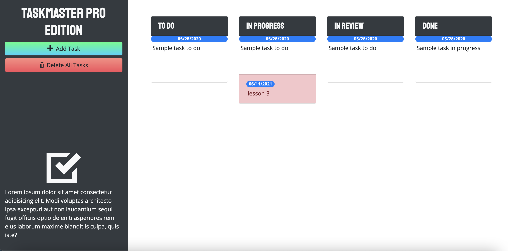

# taskmaster-pro

## Description 
Taskmaster is an online to-do list. The app allows the user to create new task as well as to save, edit and delete the task. 
The app is built using third-party libraries like j-Query and Bootstrap.

## Screenshot

## Deployment 
[Link](https://mariamv29.github.io/taskmaster-pro/)

🏆 
## Badges/ License

## Contributing / Credits

[mariamv29](https://github.com/mariamv29/README-generator.git)
